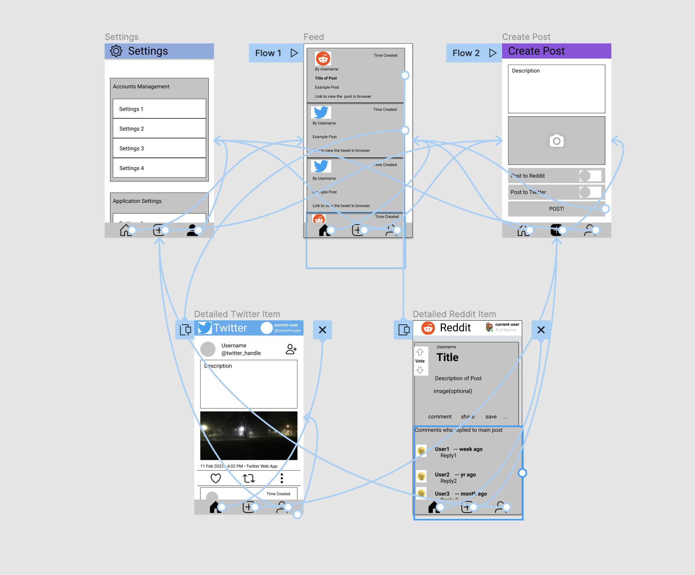
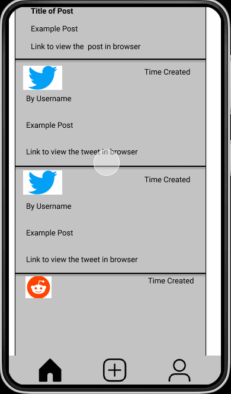

Original App Design Project - README
===

# Super Social

## Table of Contents
1. [Overview](#Overview)
1. [Product Spec](#Product-Spec)
1. [Wireframes](#Wireframes)
2. [Schema](#Schema)
3. [Milestone1](#Milestone1)

## Overview
### Description
An app that allows users to view their feeds from all social media accounts in one platform. For now, users can view Reddit and Twitter feeds. More social media platforms will be added later.  

### App Evaluation
- **Category:** Social Media
- **Mobile:** This app will be primarily developed for Android devices. 
- **Story:** Allow users to browse and post to multiple social media feeds from the comfort of one app without needing to switch between the respective apps.
- **Market:** Any individuals with Twitter and/or Reddit accounts can use the app. Benefits Influencers.
- **Habit:** The app can be used frequently depending on the user's activity on social media. Rather than switching back and forth between apps to be updated on the latest posts in each feed, the user can stay on this app to view all feeds at once.
- **Scope:** The app will initially support only Twitter and Reddit, with plans to add support for more social media feeds, such as Facebook and YouTube. 

## Product Spec

### 1. User Stories (Required and Optional)

**Required Must-have Stories**

* [ ] Users can log in to Reddit
* [ ] Users can log in to Twitter
* [ ] Users can view their Reddit feed
* [ ] Users can view their Twitter feed
* [ ] Feeds have infinite pagination
* [ ] Users can crosspost to selected social media feeds
    * [ ] Users can take photos with their camera for posts
* [ ] Users can pull-down to refresh feeds

**Optional Nice-to-have Stories**

* [ ] Users can interact with posts just like how they would in the native apps
* [ ] Users can choose which feeds they want displayed 
* [ ] Users can log in, view, and post their Facebook feed
* [ ] Users can log in, view, and watch videos from their YouTube feed

### 2. Screen Archetypes

* Feed
   * Users can view their Reddit feed
   * Users can view their Twitter feed
* Create Post
   * Users can create a post with a description and an optional photo
* Settings
   * Users can log in to Reddit
   * Users can log in to Twitter
   * (optional) Users can choose which feeds to be displayed

### 3. Navigation

**Tab Navigation** (Tab to Screen)

* Feed
* Create Post
* Settings

**Flow Navigation** (Screen to Screen)

* Feed
   * Feed item -> Detailed view
   * Reply button -> Create post
* Create post
   * Camera button -> Camera
* Settings
   * Login -> OAuth

## Wireframes
<br>

### [BONUS] Digital Wireframes & Mockups
 |


### [BONUS] Interactive Prototype


## Schema 
[This section will be completed in Unit 9]
### Models
[Add table of models]
#### Create Post

   | Property      | Type     | Description |
   | ------------- | -------- | ------------|
   | objectId      | String   | unique id for the user post (default field) |
   | author        | Pointer to User| Author of the post |
   | image         | File     | image that user posts(optional) |
   | caption       | String   | image caption by author |
   | createdAt     | DateTime | date when post is created (default field) |


#### Get Post
   | Property      | Type     | Description |
   | ------------- | -------- | ------------|
   | objectId      | String   | unique id for the user post (default field) |
   | author        | Pointer to User| Author of the post |
   | image         | File     | image that user posts(optional) |
   | caption       | String   | image caption by author |
   | createdAt     | DateTime | date when post is created (default field) |
   | captionLink   | String   | user views caption through browser |
   
   
#### Detailed Post(Extends Create Post)
   | Property      | Type     | Description |
   | ------------- | -------- | ------------|
   | objectId      | String   | unique id for the user post (default field) |
   | author        | Pointer to User| Author of the post |
   | currentUser   | Pointer to User| User logged into Reddit/Twitter |
   | image         | File     | image that user posts(optional) |
   | caption       | String   | post by author |
   | createdAt     | DateTime | date when post is created (default field) |
   | likes         | Integer  | Number of likes a post has|
   | shares        | Integer  | Number of shares/retweets a post has |

### Networking
#### List of network requests by screen
* Feed
   * (Read/GET) Query all posts for the user's Twitter and Reddit accounts
* Create post
   * (Create/POST) User creates a new post to send to Twitter and/or Reddit
* Settings
   * (Read/GET) Authenicates the user's Twitter and Reddit accounts
* Detailed Reddit Item
   * (Read/GET) Gets the current user, post user, images, and comments
   * (Create/POST) User can reply to the comment and/or like the post
* Detailed Twitter Item
   * (Read/GET) Gets the current user, tweet, tweet's user, and time created
   * (Create/POST) User can like, retweet, and share the tweet.
#### Parse network request(Read/GET) sample

         ```kotlin
         val query: ParseQuery<Post> = ParseQuery.getQuery
         query.include("user")
         query.order(byDescending: "createdAt")
         query.findObjectsInBackground { (posts: [PFObject]?, e: ParseException?)
            if (e != null) { 
               Log.e("Error getting post")
            } else if let posts = posts {
               Log.i("Successfully retrieved posts.")
           // TODO: Do something with posts...
            }
         }
         ```
 #### Parse network request(Create/POST) sample
          ```kotlin
            val apiUrl =
            getApiUrl("API Link")

        // Can specify query string params directly or through RequestParams.
        val params = RequestParams()
        params.put("status", tweetContent)
        client.post(apiUrl, params, "", handler)
         ```
### API endpoints
#### Reddit API
* Base API URL https://www.reddit.com/
   | HTTP Verb         | Endpoint | Description |
   | ------------- | -------- | ------------|
   | GET           | /api/v1/me   | Returns the identity of the user. |
   | GET           | /best   | Get a listing of links by best links. |
   | GET           | /r/subreddit/new   | Get a listing of links by new links. |
   | GET           | /r/subreddit/api/info   | Return a listing of things specified by their fullnames. |
   | POST          | /api/comment   | Submit a new comment or reply to a message. |

#### Twitter API
* Base API URL https://api.twitter.com/1.1/
   | HTTP Verb         | Endpoint | Description |
   | ------------- | -------- | ------------|
   | GET           | /search/tweets.json   | Returns a collection of relevant Tweets matching a specified query. |
   | POST          | /statuses/update.json   | Updates the authenticating user's current status, also known as Tweeting. |
   | GET           | /users/show.json   | Returns a variety of information about the user specified by the required user_id or screen_name parameter. |
   
  ## Milestone1
  
  

  
